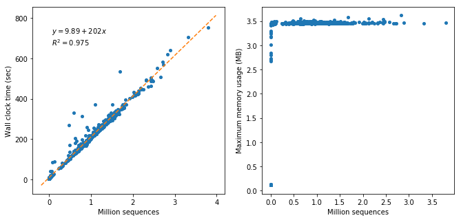

Host filtering
===============

----
Goal
----

Remove potential host genome contamination from sequencing data.

--------
Protocol
--------

We use `Bowtie2 <http://bowtie-bio.sourceforge.net/bowtie2/index.shtml>`__ (`Langmead and Salzberg, 2012 <https://www.nature.com/articles/nmeth.1923>`__) to align paired-end sequences to the host genome, then use `SAMtools <http://samtools.sourceforge.net/>`__ (`Li et al., 2009 <https://academic.oup.com/bioinformatics/article/25/16/2078/204688>`__) with `BEDtools <https://bedtools.readthedocs.io/en/latest/>`__ (`Quinlan and Hall, 2010 <https://academic.oup.com/bioinformatics/article/26/6/841/244688>`__) to remove aligned sequences and their mates.

The following command is adopted from Oecophylla, under `qc.rule <https://github.com/biocore/oecophylla/blob/7e2c8e030fb2e3943762156dd7d84fdf945dbc92/oecophylla/qc/qc.rule#L214>`__.

.. code:: bash

    bowtie2 -p {threads} -x {params.filter_db} --very-sensitive -1 {input.forward} -2 {input.reverse} 2> {log.bowtie}| samtools view -f 12 -F 256 -b -o {temp_dir}/{wildcards.sample}.unsorted.bam 2> {log.other}

    samtools sort -T {temp_dir}/{wildcards.sample} -@ {threads} -n -o {temp_dir}/{wildcards.sample}.bam {temp_dir}/{wildcards.sample}.unsorted.bam 2> {log.other}

    bedtools bamtofastq -i {temp_dir}/{wildcards.sample}.bam -fq {temp_dir}/{wildcards.sample}.R1.trimmed.filtered.fastq -fq2 {temp_dir}/{wildcards.sample}.R2.trimmed.filtered.fastq 2> {log.other}

If necessary, these three commands can be combined into one command:

.. code:: bash

    bowtie2 -p {threads} -x {params.filter_db} --very-sensitive -1 {input.forward} -2 {input.reverse} | samtools view -f 12 -F 256 | samtools sort -@ {threads} -n | samtools view -bS | bedtools bamtofastq -i - -fq {output.forward} -fq2 {output.reverse} &> {log}

Multiple host databases (:bash:`params.filter_db`) are already available on Barnacle, under: :bash:`/databases/bowtie`. Of which, **Human** is for human sequence removal, **PhiX** is to remove Illumina’s spike-in control. **Human_PhiX** is for both (we recommend using this database).

---------
Benchmark
---------

The following benchmarks were obtained on 692 AGP shotgun samples, using 4 CPUs and 8 GB memory.

Basically, the run time is linear to the sample size, while memory consumption is constant and trivial.

For a typical dataset of 1 million sequences, this step will cost roughly **3 min 30 sec**.

**Figure 1.** Performance of Bowtie2 host-filtering by sample size, as measured by wall clock time (left) and maximum memory consumption (right).
