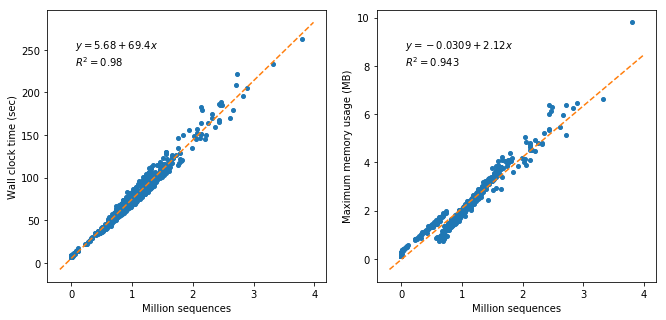

Quality control
===============

----
Goal
----

Remove sequences and regions with low quality or potential adapter contamination from the raw sequence pool.

--------
Protocol
--------

We use `Atropos <https://github.com/jdidion/atropos>`__ (`Didion et al., 2017 <https://peerj.com/articles/3720/>`__) for quality control.

The following command is adopted from Oecophylla, under `qc.rule <https://github.com/biocore/oecophylla/blob/7e2c8e030fb2e3943762156dd7d84fdf945dbc92/oecophylla/qc/qc.rule#L158>`__.

.. code:: bash

   atropos --threads {threads} {params.atropos} --report-file {log} --report-formats txt -o {temp_dir}/{f_fp} -p {temp_dir}/{r_fp} -pe1 {input.forward} -pe2 {input.reverse}

For parameters (params.atropos), we use the following:

.. code:: bash

    -a GATCGGAAGAGCACACGTCTGAACTCCAGTCAC
    -A GATCGGAAGAGCGTCGTGTAGGGAAAGGAGTGT
    -q 15 --minimum-length 100 --pair-filter any

Note: the two sequences are adapters to be removed (assuming the library prep kit is Illumina TruSeq or compatible models such as Kapa HyperPlus, which we use).

---------
Benchmark
---------

The following benchmarks were obtained on 692 AGP shotgun samples, using 8 CPUs and 8 GB memory.

Basically, the run time is linear to the sample size, while memory consumption is linear and trivial.

For a typical dataset of 1 million sequences, this step will cost roughly **1 min 15 sec**.

**Figure 1.** Performance of Atropos quality-trimming by sample size, as measured by wall clock time (left) and maximum memory consumption (right).
